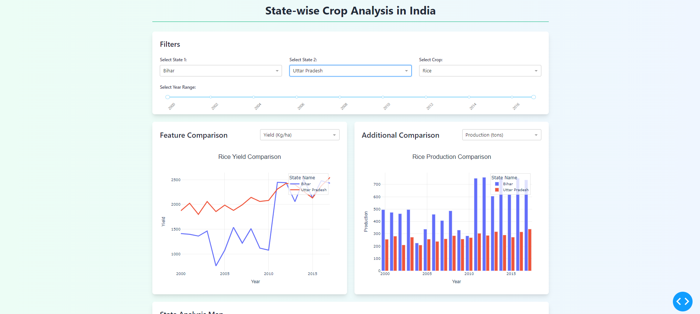
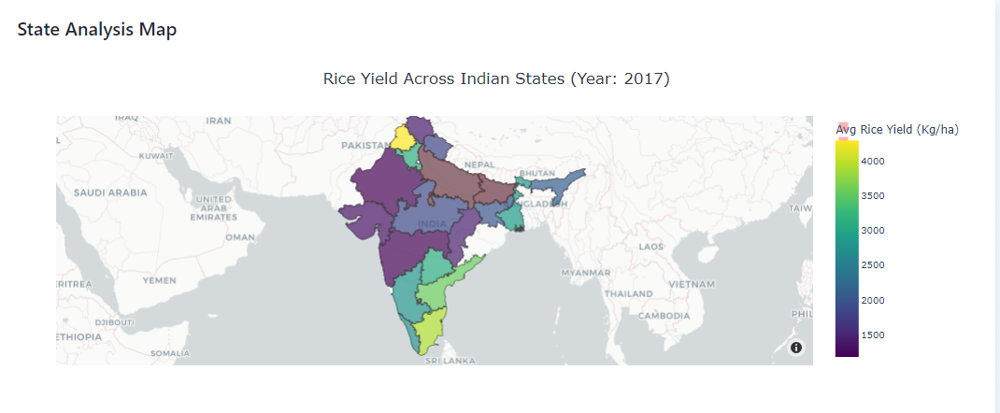
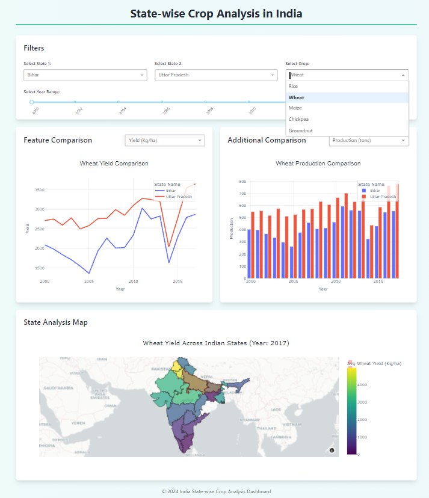

## Crop Analysis Dashboard
# Overview
The Crop Analysis Dashboard is a web-based application that provides state-wise crop analysis across India. It allows users to explore and compare various crop-related features such as yield, production,annual rainfall, irrigation area, and fertilizer consumption across different states over time. The dashboard features interactive charts, a map view, and dynamic filters for a comprehensive analysis of the crop data.
# Features

State-Wise Crop Analysis: The dashboard displays crop data for each state in India, enabling users to compare and analyze crop-related metrics.
1. Interactive Charts: Users can create line graphs and bar charts to visualize and compare crop features between two states over time.
2. Map Visualization: The dashboard includes a map view that displays state-level information, allowing users to explore the geographical distribution of crop data.
3. Dynamic Filters: Users can filter the data by selecting specific crops, states, and features (e.g., yield, production, rainfall) using interactive dropdowns and slider.
4. Historical Data Trends: The dashboard provides access to historical crop data, enabling users to analyze trends and patterns over time.

# Technologies Used

1. Dash: A Python framework for building interactive web-based dashboards.
2. Plotly: A data visualization library used for creating interactive charts and graphs.
3. Pandas: A data manipulation and analysis library used for handling and processing the crop data.
4. Geojson: A data format used for storing geographical information, which is used for the map visualization.
5. Mapbox: A mapping platform used for styling the base map in the geographic visualization.
6. Tailwind CSS: A utility-first CSS framework used for styling the dashboard components.

# Installation and Setup


## Run Locally

Clone the project

```bash
  git clone https://github.com/hitikadwani/agri_dashboard.git

```

Go to the project directory

```bash
  cd agri_dashboard
```

Install dependencies

```bash
  pip install -r requirements.txt
```

Start the server

```bash
python app.py
```


Open your web browser and navigate to http://localhost:8050 to access Dashboard.

# Usage

Use the dropdown menus to select the crop, state, and feature you want to analyze.
Explore the interactive charts and map visualization to compare crop data between states.
Adjust the filter using the sliders and dropdowns to refine your analysis.
Investigate historical data trends to identify patterns and insights.

# Images

1. 

2. 

3. 